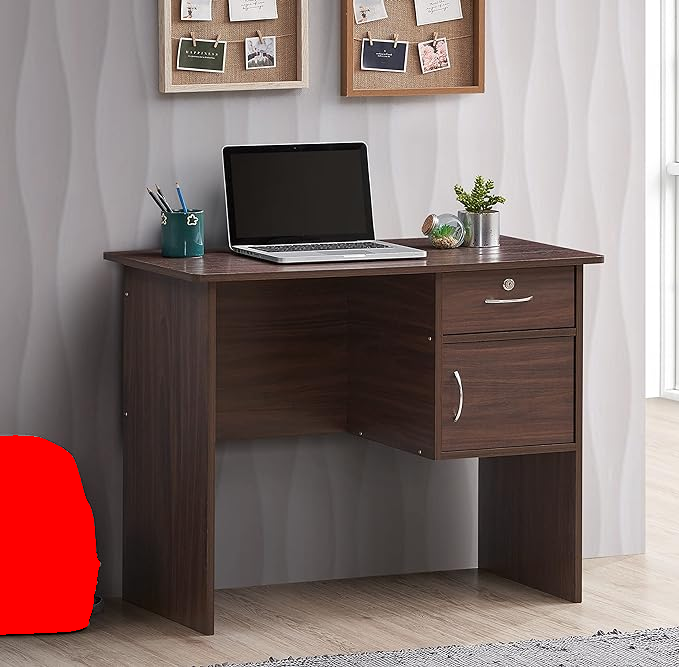
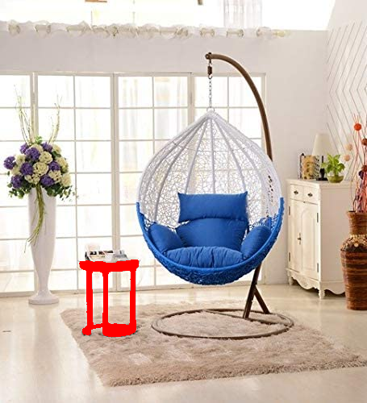
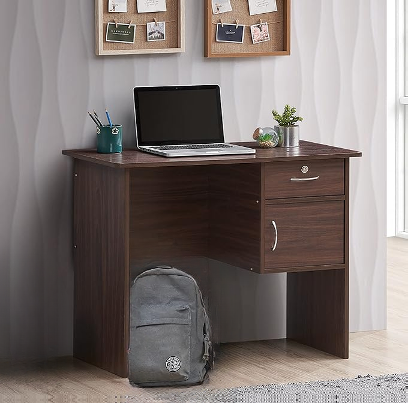
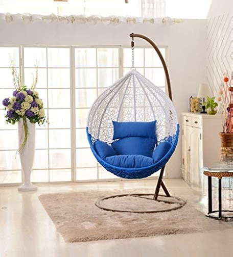
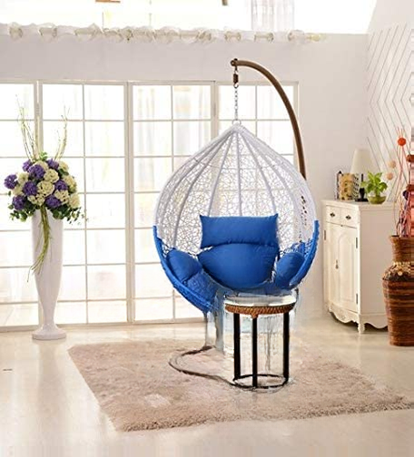
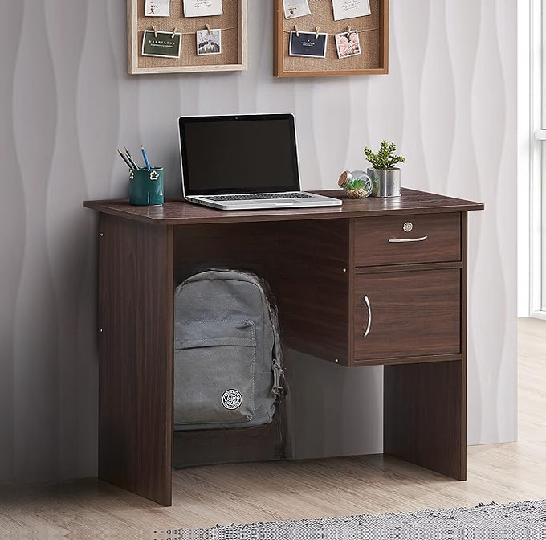

# Change the Position of an Object in a Scene

To set up the project environment and ensure that all dependencies are installed correctly, use:
```bash
conda env create -f environment.yml
```

## Task 1

### Description
This task involves taking an input scene and a text prompt from the command line argument and outputting an image with a red mask on all pixels where the object (denoted in the text prompt) was present.

### Proposed Solution
The solution leverages [groundingDINO](https://github.com/IDEA-Research/GroundingDINO) to detect the object specified in the text prompt. After detecting the object's position, the same information is used as a prompt to generate a mask using [SAM](https://github.com/facebookresearch/segment-anything)). This approach ensures precise object localization and effective masking.

### Command to Use
```bash
python run.py --image <input_path> --class <label> --output <output_path>
```
To generate the outputs below use
```bash
./run.sh
```

### Output
Text Prompt: bagpack

<div style="display: flex; justify-content: space-between;">
  <div style="text-align: center;">
    <p>Input Image</p>
    
  </div>
  <div style="text-align: center;">
    <p>Output Image</p>
    
  </div>
</div>

Text Prompt: bagpack

<div style="display: flex; justify-content: space-between;">
  <div style="text-align: center;">
    <p>Input Image</p>
    
  </div>
  <div style="text-align: center;">
    <p>Output Image</p>
    
  </div>
</div>

Text Prompt: stool

<div style="display: flex; justify-content: space-between;">
  <div style="text-align: center;">
    <p>Input Image</p>
    
  </div>
  <div style="text-align: center;">
    <p>Output Image</p>
    
  </div>
</div>

Text Prompt: wall hanging
<div style="display: flex; justify-content: space-between;">
  <div style="text-align: center;">
    <p>Input Image</p>
    
  </div>
  <div style="text-align: center;">
    <p>Output Image</p>
    
  </div>
</div>

## Task 2

### Description
The Task is to change the position of the segmented object using user prompts specifying the number of pixels to shift in x (+x being the horizontal right direction) and y (+y being the vertical up direction) directions.

### Proposed Solution

Step 1: Object Removal

**Generate Mask:** Use a model like groundingDino+SAM to generate a mask that identifies the object to be removed.
Dilate the Mask: Increase the size of the mask slightly. This is done to ensure that when the object is removed, the edges around the original location are also inpainted, preventing artifacts.

**Inpaint Using [lama](https://github.com/advimman/lama):** Pass the original image and the dilated mask to the LaMa inpainting model, which uses a stable diffusion technique to fill in the area where the object was with plausible background details.

Step 2: Object Repositioning

**Extract Object:** Use the original (non-dilated) mask to extract the object from the image.

**Shift Object and Mask:** Move the extracted object and its corresponding mask to a new position in the image.

**Create a Seamless Integration Mask:** To integrate the object seamlessly into its new location, create a new mask that includes a small area around the relocated object but excludes the object itself. This mask can be created by unmasking the pixels in the dilated mask that belong to the object.

**Final Inpainting:** Use the LaMa model again to inpaint around the newly positioned object, using the new mask to only inpaint the immediate background, ensuring that the edges of the object blend smoothly with the surrounding pixels.

### Command to Use
```bash
python run2.py --image <input_path> --class <label> --output <output_path> --x <x_pixel> --y <y_shift>
```
To generate the outputs below use
```bash
./run2.sh
``` 
### Output
X=250 Y=10 Text Prompt: bagpack


<div style="display: flex; justify-content: space-between;">
  <div style="text-align: center;">
    <p>Input Image</p>
    
  </div>
  <div style="text-align: center;">
    <p>Output Image</p>
    
  </div>
</div>

X=300 Y=10  Text Prompt: stool

<div style="display: flex; justify-content: space-between;">
  <div style="text-align: center;">
    <p>Input Image</p>
    
  </div>
  <div style="text-align: center;">
    <p>Output Image</p>
    
  </div>
</div>

X=250 Y=10  Text Prompt: wall hanging
<div style="display: flex; justify-content: space-between;">
  <div style="text-align: center;">
    <p>Input Image</p>
    
  </div>
  <div style="text-align: center;">
    <p>Output Image</p>
    
  </div>
</div>

### Failure Cases

Problem: Object Occlusion

X=300 Y=10  Text Prompt: stool
<div style="display: flex; justify-content: space-between;">
  <div style="text-align: center;">
    <p>Input Image</p>
    
  </div>
  <div style="text-align: center;">
    <p>Output Image</p>
    
  </div>
</div>

Problem: Spatial Understanding

X=300 Y=10  Text Prompt: stool
<div style="display: flex; justify-content: space-between;">
  <div style="text-align: center;">
    <p>Input Image</p>
    
  </div>
  <div style="text-align: center;">
    <p>Output Image</p>
    
  </div>
</div>

Problem: Object Occlusion

The algorithm struggles when objects in the image are partially obscured by other elements, leading to challenges in accurate object detection and repositioning. Possible Fix can be to employ segmentation that predict the contours of occluded objects and repaint on them.

Problem: Spatial Understanding

Accurately placing objects in a new position within an image requires an understanding of the spatial layout, which the current algorithm does not fully grasp. Prevent users from placing objects in unnatural positions by first detecting nearby objects using an object-to-text model. Convert these detections into a descriptive text format and then consult a Language Model (LLM) to evaluate whether the placement next to these objects is logical or not. This approach leverages advanced object recognition coupled with the contextual reasoning capabilities of LLMs to assess and guide appropriate object placements within the scene.


